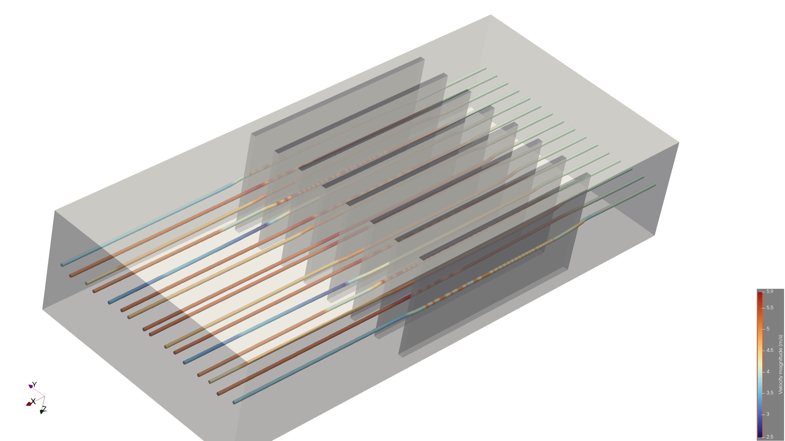
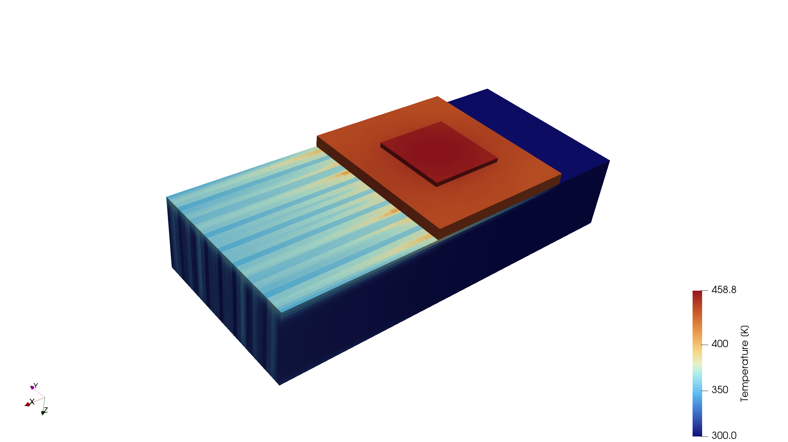
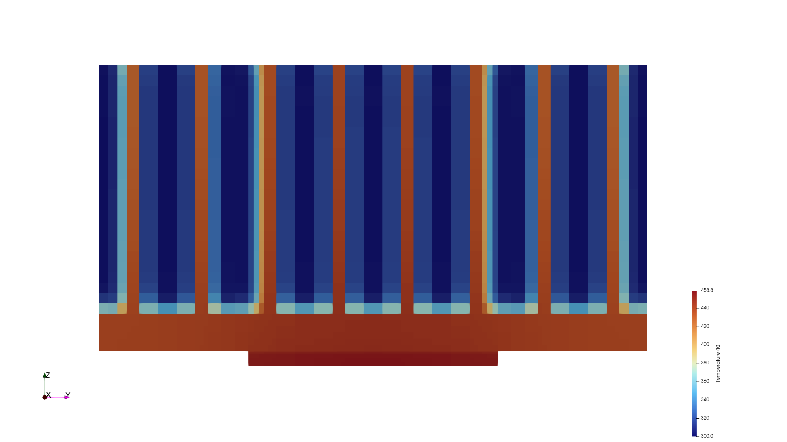
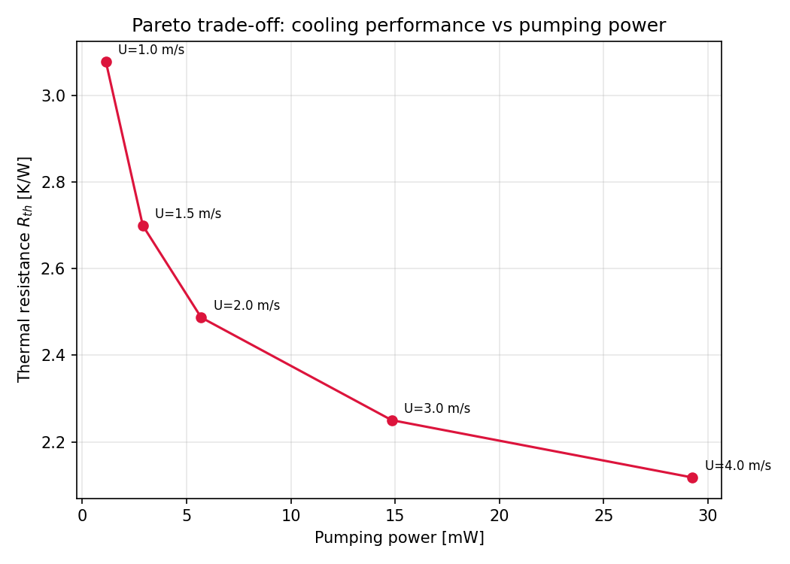

# electronics-cooling-cht



**75 W chip load | 2.49 K/W baseline R_th (laminar) | 102,915 cells | 1–4 m/s airflow sweep, Pareto analysis**

CHT simulation of an air-cooled plate-fin heat sink using OpenFOAM v2606.
Developed and run locally on a MacBook Air M2 (8 GB RAM).

Second CFD portfolio project, after [propeller-cfd](https://github.com/EvgenisSal/propeller-cfd).
That project focused on validation against experimental propeller data.
This one focuses on conjugate heat transfer and electronics cooling.

## What this project does

1. Validates the main numerical building blocks — conduction, forced
   convection, and natural convection — against analytical or benchmark
   solutions.
2. Generates the heat-sink geometry and mesh parametrically in Python,
   allowing the geometry to be rebuilt at different refinement levels.
3. Performs a mesh-independence study using GCI (Roache's method) on a
   unit-cell model.
4. Runs the full CHT problem for a 20×20 mm, 75 W chip with an 8-fin
   heat sink, using both laminar and k-omega SST models.
5. Sweeps inlet velocity from 1–4 m/s and compares thermal resistance
   against pumping power to evaluate the cooling-performance trade-off.

## Physical setup

Air-cooled plate-fin heat sink, envelope 100×44×24.2 mm.

- Silicon chip: 20×20×1 mm, k = 150 W/mK, 75 W total heat load
- TIM (thermal interface material): 20×20×0.2 mm, k = 5 W/mK
- Aluminium base: 40×44×3 mm, k = 200 W/mK
- 8 aluminium fins: 40×1×20 mm, 4.5 mm gap, 5.5 mm pitch
- Air channel above the fins, inlet air at 300 K

Air properties assumed constant: rho = 1.1, mu = 1.9e-5, cp = 1005,
Pr = 0.71, k = 0.0269 (SI units). Channel Reynolds number is roughly
850–1700 depending on inlet velocity, so both laminar and
turbulence-modelled cases were compared.

## Phase 1 — Verification

Before touching the real geometry, three simple cases check that the
solver reproduces the three heat transfer modes present in the heat
sink: conduction, forced convection, natural convection.

| Case | Physics | Result | Reference | Error |
|---|---|---|---|---|
| composite-wall | 1D conduction, two solid regions (`chtMultiRegionSimpleFoam`) | T_interface = 344.437 K | Analytical (thermal circuit) | 0.0022% |
| flat-plate | Forced convection, laminar boundary layer | Nu_x vs Blasius | Blasius similarity solution | <3% over front 70% of plate |
| cavity | Natural convection, Ra = 1e5 | Nu_avg = 4.69 | de Vahl Davis (1983) benchmark | 3.8% |

Details, meshes, and reproduction steps are in `verification/<case>/README.md`
for each of the three.

The cavity case initially showed 25–59% error because the solution had
not fully converged. Residuals had plateaued at 1e-4 without a
`residualControl` block. Every case in this repo since then uses explicit
residual control, and post-processing scripts auto-detect the latest
converged timestep instead of reading a hardcoded one.

## Phase 2 — Parametric geometry

The heat sink mesh is built by a Python script (`genBlockMesh.py`) that
writes `blockMeshDict` directly, rather than through CAD or snappyHexMesh.
The script classifies every block into one of four cellZones (air, chip,
TIM, heatsink) using a geometric rule — "is this block's (x,y) footprint
inside the chip window and this z inside the chip layer" — rather than a
hardcoded list of which block is which. This allows the same script to
generate both the symmetric unit-cell mesh and the full 8-fin geometry
without rewriting the block-assignment logic.

After `blockMesh`, `splitMeshRegions -cellZones` splits the single mesh
into four conformal regions with automatically named coupling interfaces
(e.g. `chip_to_TIM`, `heatsink_to_air`), which `chtMultiRegionSimpleFoam`
solves as a proper conjugate problem.

## Phase 3 — Mesh independence (unit cell)

Because a mesh study needs many runs at increasing resolution, this part
uses a 1-pitch unit-cell slice (symmetry planes on both sides) rather
than the full 8-fin geometry — one fin, one channel, uniform heating
approximation, used only for the mesh-convergence study.

Three meshes (49k / 111k / 238k cells, refinement ratio ≈1.3) were run
to steady state, and Roache's GCI method applied to the peak chip
temperature:

- Apparent order of convergence: p = 0.485
- Asymptotic range check: 1.003 (should be ≈1.0 — this is valid)
- Fine-mesh uncertainty: 3.0% on T_max, 13.5% on R_th
- R_th (fine mesh) = 17.39 K/W, Richardson-extrapolated R_th = 19.27 K/W

**Erratum:** the unit-cell model originally used TIM conductivity
k = 4 W/mK instead of the verified value of 5 W/mK. The GCI sweep was
rerun with the corrected value. The previous results are kept in
`heatsink/unit-cell/mesh-independence-k4-WRONG.dat` for traceability.
The correction changed T_max by about 0.2 K across all three meshes and
had negligible effect on the GCI ratio and asymptotic range check. Full
writeup in `docs/logbook.md`.

## Phase 4 — Full-geometry baseline

The unit-cell model assumes uniform heating over one fin pitch. The
full model instead uses the actual 20×20 mm chip footprint, all eight
fins, and the complete side boundaries, 102,915 cells.

**Laminar run:** T_max (chip) = 486.55 K, R_th = 2.49 K/W. Energy
balance checked via a `wallHeatFlux` functionObject on the heatsink
region: 75.00 W in from the TIM side, 75.00 W out to the air side —
matches the applied 75 W load almost exactly.

**k-omega SST run** (same mesh, same load): T_max = 483.63 K,
R_th = 2.45 K/W — about 1.6% lower than laminar. Given the channel
Reynolds number sits in the transitional range, this was worth checking
explicitly rather than assuming laminar was fine. The difference turned
out small enough that laminar is a reasonable simplification for the
parametric study in Phase 5.

**Why R_th here (2.49 K/W) is so much lower than the unit-cell number
(17.4 K/W):** the unit-cell R_th is a per-fin number — one fin carrying
1/8 of the load. Eight fins carrying the full load in parallel behave
like eight resistances in parallel: R_th ≈ 17.4/8 ≈ 2.2 K/W would be
the naive estimate. The difference is attributed to spreading resistance
(heat has to spread laterally from the small chip footprint into the
full 40×44 mm base before it reaches the outer fins) and to non-uniform
flow between interior and outer fin channels.

### Results


*Baseline temperature field, laminar, U = 2 m/s. Chip footprint visible
as the small hot square; heat spreads through the base before reaching
the fins.*


*Vertical cross-section through the chip centreline: chip → TIM →
aluminium base → fins → air, in one view.*


*Streamlines through the fin channels, coloured by velocity magnitude (2.5–5.9 m/s). 
Flow accelerates in the narrow channels between fins.*

## Phase 5 — Parametric airflow study and Pareto front

The airflow sweep evaluates the trade-off between thermal resistance
and pumping power. Swept inlet velocity (U = 1.0, 1.5, 2.0, 3.0, 4.0 m/s),
laminar (justified above), same full-sink mesh and load, extracting
T_max and inlet/outlet pressure drop via `surfaceFieldValue`
functionObjects each run.

Airflow velocity was selected as the swept parameter because it can be
varied without regenerating the mesh (a change to `0/air/U` and a
rerun). Fin-spacing and fin-height studies would require remeshing per
point and were left outside the present scope.

| U (m/s) | T_max (K) | R_th (K/W) | dP (Pa) | Pumping power (mW) |
|---|---|---|---|---|
| 1.0 | 530.87 | 3.078 | 1.29 | 1.14 |
| 1.5 | 502.48 | 2.700 | 2.20 | 2.90 |
| 2.0 | 486.55 | 2.487 | 3.24 | 5.70 |
| 3.0 | 468.75 | 2.250 | 5.62 | 14.84 |
| 4.0 | 458.82 | 2.118 | 8.31 | 29.25 |

Pumping power = dP × Q, with Q = U × inlet cross-section area.


*Thermal resistance vs. pumping power. All five points are Pareto-optimal
— none is beaten on both axes by another.*

**Pareto interpretation:** below U ≈ 2 m/s, small increases in pumping
power buy large drops in R_th (U: 1→2 m/s costs +4.6 mW for -0.59 K/W).
Above U ≈ 2.5–3 m/s, returns diminish sharply (U: 3→4 m/s costs
+14.4 mW for only -0.13 K/W). Since there's no single optimal point on
a Pareto front, the curve shows a clear reduction in marginal thermal
benefit above approximately 2–3 m/s. The actual operating point would
depend on an external constraint (a maximum allowable junction
temperature, a specific fan's pressure-flow curve, a noise or power
budget), which this project does not fix.

## Limitations

- Air properties are constant (no temperature-dependent rho, mu, k).
  Reasonable for the temperature range here (300–490 K) but would need
  revisiting for a wider range.
- The parametric sweep (Phase 5) is laminar throughout, based on the
  small laminar/SST difference found at one operating point in Phase 4.
  That difference (1.6%) may not hold exactly at every swept velocity —
  it wasn't rechecked at each point, to keep the sweep to a reasonable
  number of runs.
- No fin-geometry (spacing, height) sweep — see Phase 5 above for why,
  and it's the natural next step for this project.
- Steady-state RANS only. No transient effects, no vortex shedding in
  the wake of the fins.


## Reproduce

Requires OpenFOAM v2606.

```bash
# Verification cases
cd verification/<case-name>
blockMesh && <application>   # see each case's README for specifics

# Unit-cell mesh independence + GCI
cd heatsink/unit-cell
python3 genBlockMesh.py 1.0        # or 1.3, 1.69 for other refinement levels
blockMesh
splitMeshRegions -cellZones -overwrite
chtMultiRegionSimpleFoam
python3 gci.py                     # after all three refinement levels are run

# Full-sink baseline
cd heatsink/full-sink
python3 genBlockMesh.py
blockMesh
splitMeshRegions -cellZones -overwrite
chtMultiRegionSimpleFoam

# Airflow parametric sweep + Pareto plot
cd heatsink/full-sink
./airflowSweep.sh 2.0 U2            # repeat per velocity point
python3 parametric_pareto.py
```

## Repository structure

```
verification/            # Phase 1: composite-wall, flat-plate, cavity
docs/
  geometry-design.md      # geometry, materials, physics assumptions
  logbook.md               # chronological build log, including the TIM errata
heatsink/
  unit-cell/               # Phase 2-3: parametric geometry, GCI mesh study
  full-sink/               # Phase 4-5: full baseline, laminar/SST, airflow sweep
    paraview/               # result screenshots
```
